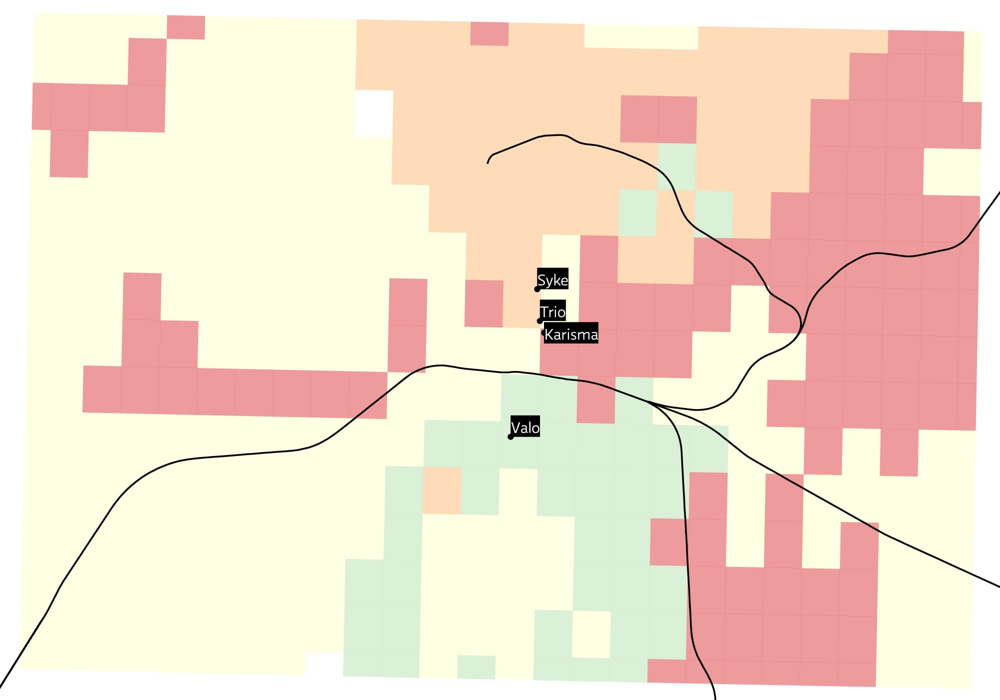
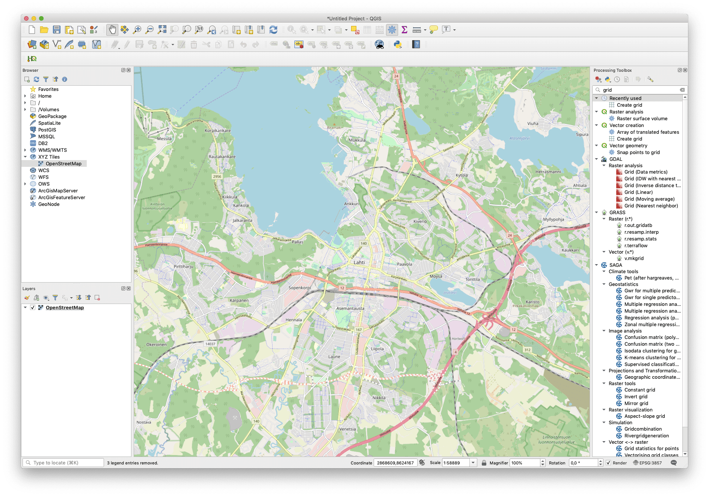
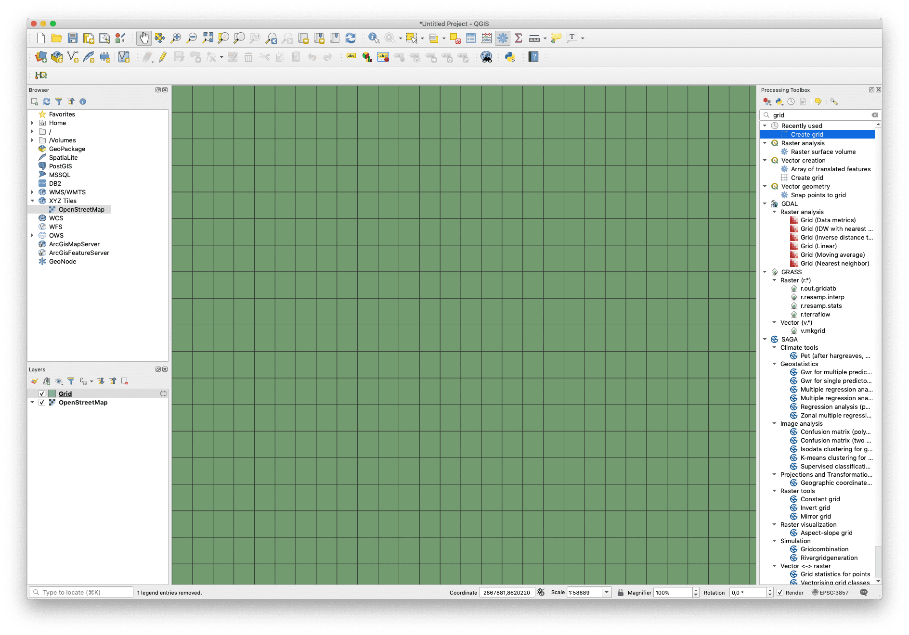
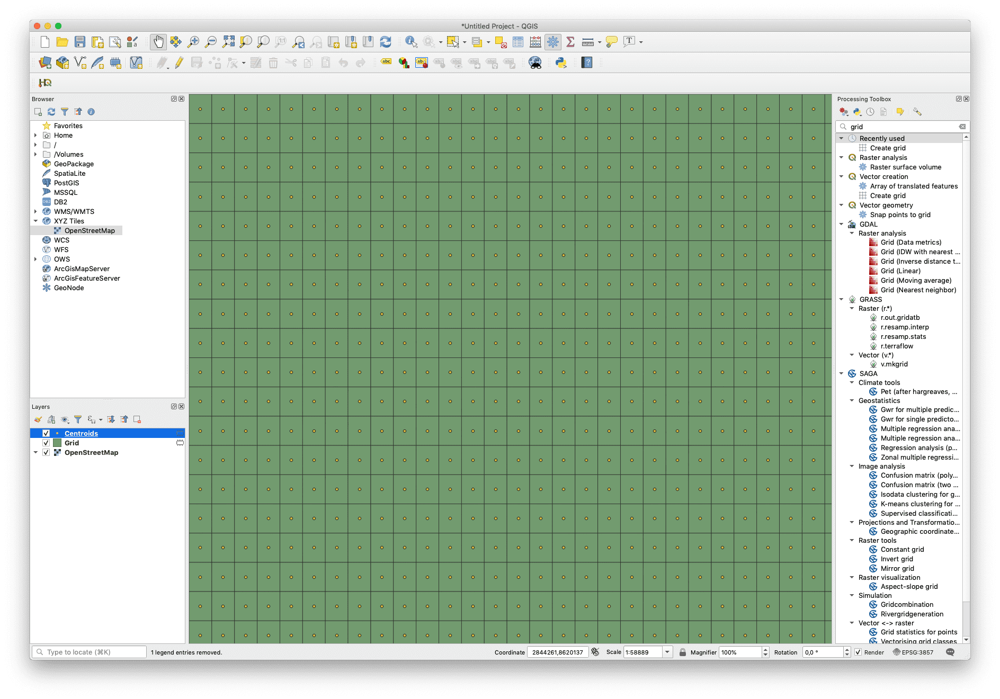

# Travel Time Matrix  
A guide to create travel time matrices using the Digitransit Routing API and the HERE Route API.  
  
  
  
This is Lahti region and Lahti's four shopping centres. An example of how to read the matrix: When using public transport, Karisma is the closest shopping centre anywhere in the red area.  
## Table of Contents  
1. [Used technologies](#used-technologies)  
2. [Preparations](#preparations)  
3. [Digitransit Routing API](#digitransit-routing-api)  
3. [HERE Route API](#here-route-api)  
4. [Color the matix](#color-the-matrix)  
## Used technologies:  
* QGIS3.8  
* Python 3.7  
## Preparations  
Our first mission is to create a list of origin coordinates and target coordinates. In the example above, the origin coordinates are the coordinates of the shopping centers and the target coordinates are the centroids of the rectangles.  
  
My **origin coordinates** look like this:  

| name  | longitude | latitude |
| --- | --- | --- |
| Trio  | 25,663247  | 60,983039  |
| Syke  | 25,662369  | 60,9870982  |
| Karisma  | 25,6644217  | 60,9815407 |
| Valo  | 25,6561868  | 60,9681626  |
  
Then we create a table of **target coordinates**. We start by opening QGIS and choosing the area we like to focus on. You may use the OpenStreetMap from XYZ Tiles as a help. Borders of the window will be the borders of our matrix. Create a grid using the Create grid tool from the Processing Toolbox.  
  
  
  
Set Grid type to Rectangle (polygon) and Grid extent to Use Canvas Extent. Grid CRS has to be EPSG:4326 – WGS 84 to work. Lastly, set the spacing (in degrees) to for example 0,008. The smaller the number the more time consuming it will be to create the matrix.  
  
  
  
Select the grid you just created. From Vector -> Geometry Tools -> Add Geometry Attributes add the geometry attributes to the layer. At this point it may be wise to save the grid layer as GeoJSON to a folder for later use.  

Add centroids of the grid by choosing Vector -> Geometry Tools -> Centroids. Add geometry attributes to the newly added points as well. Save the centroids layer as GeoJSON for further use.  
  
  
  
Lastly, export centroids layer as csv. Take the index column and the coordinate columns with you. The file should look something like this:  
  
| Id  | longitude | latitude |
| --- | --- | --- |
| 1  | 25,52843866  | 61,02111019  |
| 2  | 25,52843866  | 61,01511019  |
| 3  | 25,52843866  | 61,00911019  |
| 4  | 25,52843866  | 61,00311019  |
| 5  | 25,52843866  | 60,99711019  |  
  
Now that you have the origin coordinates and the target coordinates, it is time to create our matrix.  
## Digitransit Routing API
Use [Digitransit Routing API](https://digitransit.fi/en/developers/architecture/x-apis/1-routing-api/) to calculate travel times between coordinates via public transport.  
## HERE Route API  
Text  
## Color the matrix 